# Strata Architecture

Strata is a Valorant performance intelligence and coaching application. Its core loop is:

```text
ingestion -> normalized match history -> deterministic analytics -> review -> coaching
  -> recommendations -> future evidence -> progress/effectiveness
```

The first public release is designed to be usable without Riot credentials and without
AI credentials. Synthetic Riot-compatible data is a supported initial provider, not a
UI-only mock.

## System Diagram

```mermaid
flowchart LR
    Internet[Public internet / hosted demo users] --> Browser[Browser]
    Browser --> Frontend[React + TypeScript frontend]
    Frontend --> API[FastAPI backend]
    API --> Services[Application and domain services]
    Services --> DB[(PostgreSQL 16 validated architecture / SQLite for public demo, local, and test use)]

    subgraph Providers[Provider boundary]
        Synthetic[SyntheticMatchProvider]
        Riot[RiotApiProvider - future approved access]
        Synthetic --> Validation[Shared payload validation]
        Riot --> Validation
        Validation --> Normalization[Shared normalization]
        Normalization --> Persistence[Shared match persistence]
    end

    API --> Providers
    Persistence --> Matches[(Normalized matches)]
    Matches --> Analytics[Deterministic analytics]
    Analytics --> Reviews[Review workflow]
    Reviews --> Coaching[Deterministic coaching]
    Coaching --> Recommendations[Recommendations and focus areas]
    Recommendations --> Progress[Progress and effectiveness evidence]

    Analytics --> Evidence[Deterministic evidence package]
    Reviews --> Evidence
    Evidence --> OptionalAI[Optional AI provider]
    OptionalAI --> Coaching
```



AI is visually and architecturally downstream of deterministic evidence. It may refine
or phrase guidance when configured, but it does not own statistical facts.

## Implemented

| Area | Current behavior |
| --- | --- |
| Frontend | React + TypeScript application with Home, Matches, Insights, Review, Coach, Progress, and Settings surfaces. |
| Backend | FastAPI routes organized by feature area, backed by SQLAlchemy models and services. |
| Public deployment | Render hosts the public portfolio demo at `https://strata-s41v.onrender.com`, backed by `https://strata-apii.onrender.com`. It uses read-only demo mode, deterministic synthetic data, and ephemeral SQLite by design. |
| Persistence | SQLAlchemy supports SQLite for local/test workflows and the public demo runtime. PostgreSQL 16 is the validated production-style architecture, and Alembic owns schema evolution. Docker PostgreSQL 16 validation passed locally; this is not cloud production load validation. |
| Database integrity | External match IDs are enforced unique at the database layer, with application-level duplicate handling retained for clear import behavior. |
| Ingestion | Synthetic provider and retained Riot adapter feed shared payload validation, normalization, and match persistence. |
| Demo data | `python -m app.seed_demo` imports 40 deterministic fictional matches. Repeat runs skip existing demo match IDs. |
| Offline operation | Core demo startup, analytics, review, coaching, and progress operate without Riot or OpenAI credentials. |
| Analytics | Backend services compute deterministic recent/baseline form, map/agent/role breakdowns, streaks, trends, volatility, and progress comparisons. |
| Review | Users can add/edit/delete review notes and issue tags, then view recurring issue groups. |
| Coaching | Deterministic coaching is the default. Optional AI refinement exists behind explicit configuration. |
| Recommendations and progress | Recommendations persist independently of reports. Progress evaluates a selected recommendation with deterministic before/after evidence and exposes `insufficient_data`, `directional`, and `supported` sample-aware states. The client cannot fabricate effectiveness outcomes. |
| Public demo protection | `PUBLIC_DEMO_MODE` keeps hosted demo reads available while rejecting protected mutations with a read-only response. |
| Startup | FastAPI lifespan startup initializes the application lifecycle and database setup used by the local/demo path. |

## P1 / Planned

| Area | Planned direction |
| --- | --- |
| Authentication and session isolation | Required before public shared write access is enabled. Current demo assumptions must not be treated as multi-user isolation. |
| Riot production access | Requires Riot approval of the finished application. The adapter is retained, but live production access is not available to the demo. |
| Background Riot sync | Redis, Celery, and an asynchronous SyncJob workflow remain deferred. A future workflow should handle retries, 429s, stale jobs, idempotency, and duplicate requests. |
| Observability extensions | Structured logs, request IDs, health/readiness, and Prometheus metrics are implemented. OpenTelemetry instrumentation and Grafana dashboards remain pending. |

Redis, Celery, or equivalent distributed job infrastructure is not implemented in the
current release baseline and should not be depicted as live infrastructure.

## Provider Boundary

The provider boundary exists to keep source-specific concerns outside the domain model.

```text
SyntheticMatchProvider or RiotApiProvider
  -> shared consumed-payload validation
  -> shared normalization
  -> MatchImportItem
  -> shared duplicate-skipping persistence
  -> Match rows
  -> deterministic analytics and coaching
```

The synthetic fixture is a reduced Riot-like consumed projection. It is entirely
fictional and contains no real player information. It does not seed review observations,
profile data, recommendation history, or progress outcomes.

The retained Riot adapter is future-facing until production API access is approved.
Real Riot payloads must continue to pass through the same validation, normalization,
and persistence path as synthetic payloads.

## Application Layers

### Browser and Frontend

The browser renders the React application and sends API requests to FastAPI. The
frontend owns UI state, routing, presentation, and interaction ergonomics. It should not
invent analytics, mutate domain history directly, or hardcode finished fake domain
objects.

### FastAPI

FastAPI coordinates route-level concerns: validation at the API edge, dependency
injection, database sessions, and feature orchestration. Route modules map to product
areas such as matches, insights, review, coaching, progress, settings, and home.

### Application and Domain Services

Services own ingestion, analysis, review grouping, coaching generation, and progress
calculation. Deterministic services produce the factual evidence that later layers
consume.

### Persistence

SQLAlchemy stores normalized matches, review notes, issue tags, coaching reports,
persisted recommendations, progress snapshots, and profile context. PostgreSQL 16 is
the validated production-style database architecture and Alembic provides explicit
schema migrations. Local Docker PostgreSQL 16 validation reached migration head
`20260908_0001`, confirmed the readiness path, and passed the dedicated schema/data
smoke checks. The public Render demo intentionally uses ephemeral SQLite because it is
read-only, synthetic, and reseeded on startup. No cloud production load validation is
claimed.

## Deterministic Analytics and AI

Deterministic analytics calculate facts: performance windows, comparisons, breakdowns,
trends, volatility, issue recurrence, and recommendation evidence. AI may interpret,
summarize, or rephrase these facts when explicitly enabled.

Core operation must remain available when AI is disabled or unavailable. AI output must
be grounded in supplied evidence and should fail closed to deterministic behavior where
the selected mode supports fallback.

## Current Module Shape

```text
backend/
  app/
    main.py
    seed_demo.py
    api/routes/       # matches, insights, review, coach, progress, settings, home
    core/             # configuration and database sessions
    models/           # SQLAlchemy entities
    schemas/          # Pydantic API contracts
    services/
      ingestion/      # payload validation, adapters, normalization, persistence
      analysis/
      coaching/
      progress/
      review/
    repositories/
  seeds/
  scripts/
  tests/
frontend/
  src/
    app/
    components/
    features/         # home, matches, insights, review, coach, progress, settings
    services/api/
    types/
```

## Key Tradeoffs

- Synthetic Riot-compatible ingestion is more honest than hardcoded UI/database state
  because it exercises the same validation, normalization, persistence, analytics, and
  coaching path intended for real data.
- Deterministic analytics before AI keeps numbers auditable and lets the app work
  without external model credentials.
- PostgreSQL and Alembic provide the durable production-style persistence path; the
  public portfolio deployment intentionally chooses ephemeral SQLite to keep costs near
  zero while preserving the validated Postgres path for future durable deployments.
- Background synchronization is intentionally deferred. First release behavior should be
  synchronous/provider-driven rather than pretending distributed execution already
  exists.
- Public shared writes should remain restricted or disabled until authentication and
  session isolation exist.
