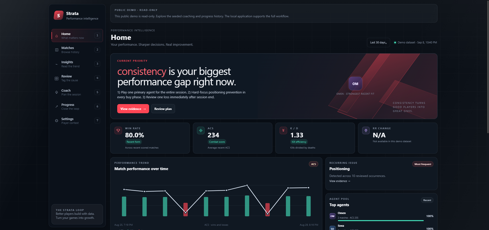
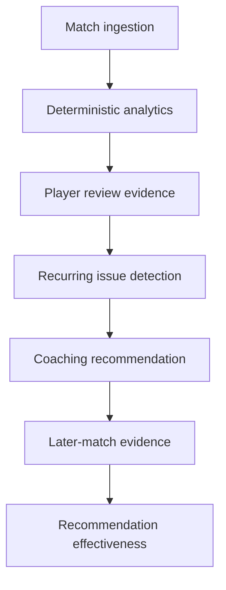
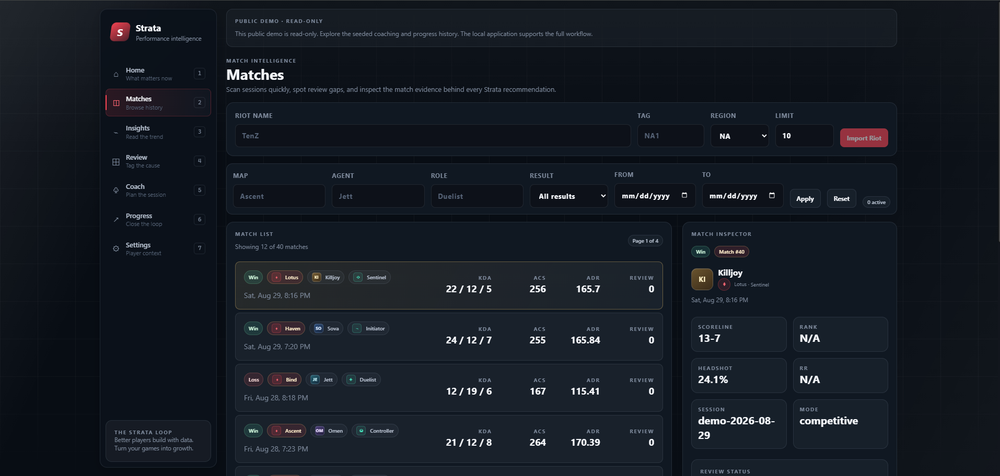
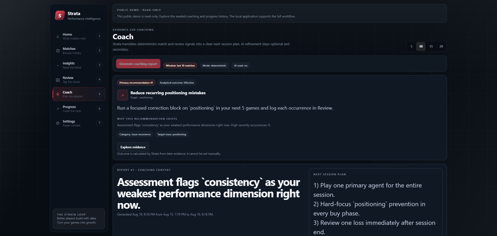
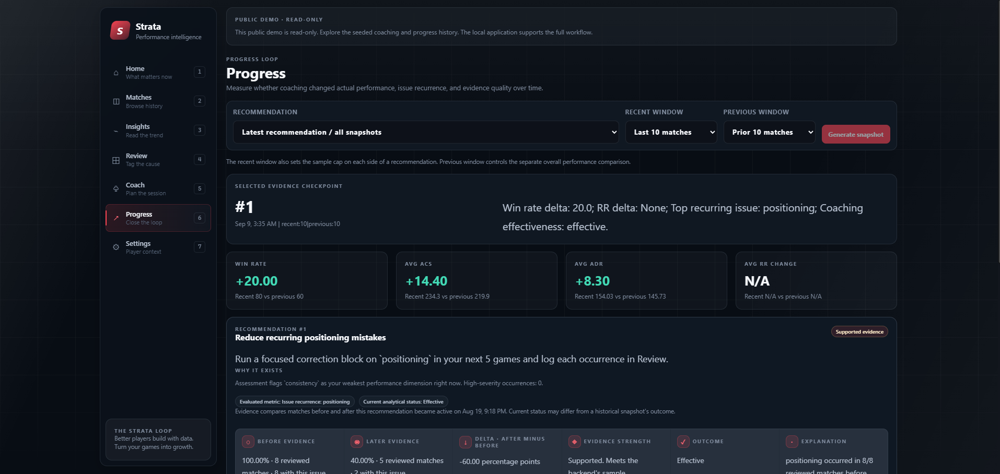
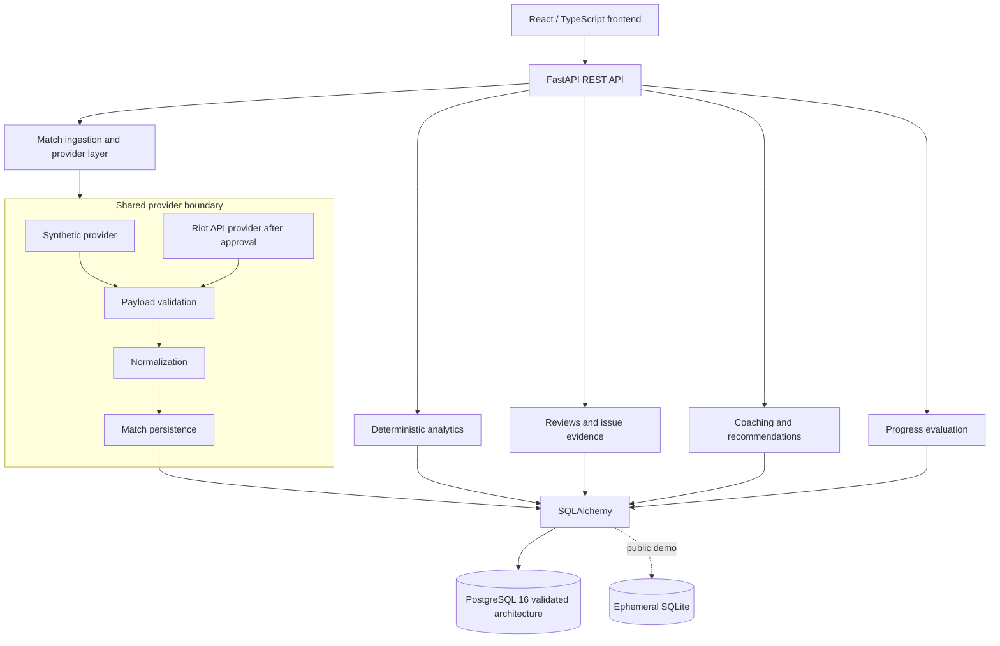

# Strata

[](https://github.com/RajRaghupatruni/Strata/actions/workflows/ci.yml)

**Valorant performance intelligence and coaching platform that turns match history into evidence-backed recommendations and measures whether those recommendations actually worked.**

[Live Demo](https://strata-s41v.onrender.com) · [API Health](https://strata-apii.onrender.com/health) · [API Readiness](https://strata-apii.onrender.com/ready)

The public portfolio demo is intentionally zero-cost to operate: a React/Vite static site, a FastAPI web service, deterministic synthetic data, read-only demo mode, and an ephemeral SQLite database reseeded on startup. The production-style persistence path remains PostgreSQL 16 with Alembic migrations and is exercised locally and in CI.



## What Strata Does



Strata does not stop at generating advice. Recommendations are persisted, later evidence is evaluated against them, and the backend owns the resulting effectiveness outcome.

## Product Screenshots

### Match History



Seeded synthetic match history with map, agent, combat, result, and timing context.

### Evidence-Backed Coaching



Coaching recommendations are grounded in deterministic evidence and persisted backend state.

### Closed-Loop Progress



Progress connects a recommendation to later-match evidence and measured effectiveness.

## Engineering Highlights

- FastAPI/Pydantic/SQLAlchemy backend organized around product routes and domain services.
- PostgreSQL 16 and Alembic schema migration path, with SQLite retained for local tests and the public demo runtime.
- Provider boundary separates deterministic synthetic ingestion from future approved Riot ingestion.
- Synthetic and Riot-like data use shared validation, normalization, duplicate handling, persistence, and analytics paths.
- Durable normalized match history with database-enforced external match uniqueness.
- Deterministic analytics are separated from optional AI interpretation.
- Persisted Recommendation lifecycle with backend-owned analytical outcomes.
- Recommendation-specific before/after progress evaluation with sample-aware evidence levels.
- Structured JSON logging, request IDs, health/readiness checks, and Prometheus metrics.
- Docker Compose and GitHub Actions cover backend tests, migrations, frontend build, dependency audits, and secret scanning.

## Architecture



Live Riot production access is not part of the public demo. The retained adapter is behind the same provider boundary and requires Riot approval and credentials before it is useful in a real deployment.

## Public Demo Vs Validated Architecture

| Area | Public portfolio demo | Validated architecture |
| --- | --- | --- |
| Database | Ephemeral SQLite in the backend container | PostgreSQL 16 |
| Data | Deterministic synthetic dataset | Same normalized domain model |
| Mutations | Read-only demo mode | Full local workflow |
| Migrations | Alembic on startup | Alembic on startup/CI |
| Purpose | Cheap public demonstration | Production-style engineering validation |

The public demo uses SQLite because it contains no real users, no durable user data, and a deterministic seed that is recreated on startup. PostgreSQL behavior is exercised through Docker and GitHub Actions.

## Recommendation Effectiveness

Recommendations are first-class persisted entities. Review evidence links recurring issues to recommendations, and subsequent matches provide after-evidence for evaluation.

The progress evaluator compares issue recurrence and performance metrics, then stores computed evidence. Evidence strength is separate from outcome:

| Concept | Values |
| --- | --- |
| Evidence level | `insufficient_data`, `directional`, `supported` |
| Recommendation lifecycle | `active`, `completed`, `superseded` |
| Analytical outcome | `effective`, `ineffective`, `inconclusive` |

`supported` means the sample is strong enough for Strata's deterministic evaluator. It is not a statistical-significance claim.

## Deterministic Analytics Before AI

**The model may explain the numbers. It does not create the numbers.**

Win rate, ACS, K/D, recurring issue counts, before/after evidence, and recommendation effectiveness are calculated deterministically. AI is optional interpretation behind a provider boundary, and the public demo remains useful with AI disabled.

See [ADR 0001: Deterministic Analytics Before AI](docs/adr/0001-deterministic-analytics-before-ai.md).

## Reliability And Observability

The backend includes structured JSON logs, request IDs, request latency, operation timing, `/health` liveness, `/ready` database readiness, and Prometheus metrics at `/metrics`.

Example metric names:

- `strata_http_requests_total`
- `strata_http_request_duration_seconds`
- `strata_analytics_calculation_duration_seconds`
- `strata_recommendation_evaluation_duration_seconds`

Request bodies and secrets are not logged. Metric labels use normalized routes to avoid high-cardinality path values. Prometheus instrumentation exists; hosted Grafana dashboards remain future work.

## PostgreSQL Validation Evidence

Local Docker PostgreSQL 16 validation has passed with migration head `20260908_0001`.

Verified results:

- 8 migrated tables
- 17 indexes
- 40 seeded matches
- 1 persisted recommendation
- 1 persisted progress record
- persisted progress evidence
- JSONB verified
- external match uniqueness verified
- foreign keys verified
- repeat-safe seeding verified

GitHub Actions independently exercises PostgreSQL migrations with a PostgreSQL 16 service. This is schema and behavior validation, not production cloud load testing.

## Running Locally

```bash
docker compose up --build -d
docker compose run --rm backend python -m app.seed_demo --allow-nonlocal
```

Then open:

| Service | URL |
| --- | --- |
| Frontend | `http://127.0.0.1:5173` |
| API | `http://127.0.0.1:8000` |
| Health | `http://127.0.0.1:8000/health` |
| Readiness | `http://127.0.0.1:8000/ready` |
| Metrics | `http://127.0.0.1:8000/metrics` |

Run the PostgreSQL smoke check:

```bash
docker compose run --rm backend python scripts/smoke_test_postgres.py --repeat-seed
```

The Docker backend applies `alembic upgrade head` before Uvicorn starts. One-off `docker compose run` commands execute the supplied command and exit normally.

## Testing And CI

GitHub Actions runs:

- backend unit tests
- Python compile validation
- PostgreSQL migration upgrade/downgrade/upgrade cycle
- migrated-table schema assertion
- frontend TypeScript check
- frontend production build
- runtime npm dependency audit
- Python dependency audit
- repository secret scan with Gitleaks

See [docs/CI.md](docs/CI.md) for the workflow summary.

## Security And Public Demo Behavior

The hosted demo runs with `PUBLIC_DEMO_MODE=true` and synthetic data only. Protected mutations return a read-only response in the public demo, including match import, Riot sync, review mutations, coaching generation, recommendation updates, progress generation, and settings changes.

Local development can still run the mutable workflow when demo mode is disabled.

## Key Design Decisions

- [ADR 0001: Deterministic Analytics Before AI](docs/adr/0001-deterministic-analytics-before-ai.md)
- [ADR 0002: Synthetic and Riot Provider Boundary](docs/adr/0002-synthetic-and-riot-provider-boundary.md)
- [ADR 0003: PostgreSQL and Alembic](docs/adr/0003-postgresql-and-alembic.md)
- [ADR 0004: Background Sync Deferred From First Release](docs/adr/0004-background-sync-deferred-from-first-release.md)

## Tradeoffs And Future Work

- Riot production API integration after approval.
- Asynchronous ingestion and SyncJob workflow.
- Redis/Celery or equivalent task processing if background sync needs it.
- Rate limiting, retry, and backoff behavior for live Riot ingestion.
- OpenTelemetry distributed traces.
- Prometheus and Grafana operational dashboard.
- Authenticated multi-user deployment.

## Tech Stack

| Area | Stack |
| --- | --- |
| Frontend | React, TypeScript, Vite |
| Backend | FastAPI, Pydantic, SQLAlchemy |
| Persistence | PostgreSQL 16, SQLite demo runtime, Alembic |
| Runtime | Docker, Docker Compose, nginx |
| Observability | structured logging, Prometheus metrics, health/readiness |
| CI/security | GitHub Actions, pip-audit, npm audit, Gitleaks |

## Disclaimer

Strata is an independent portfolio project and is not affiliated with or endorsed by Riot Games. VALORANT and related trademarks belong to Riot Games.
